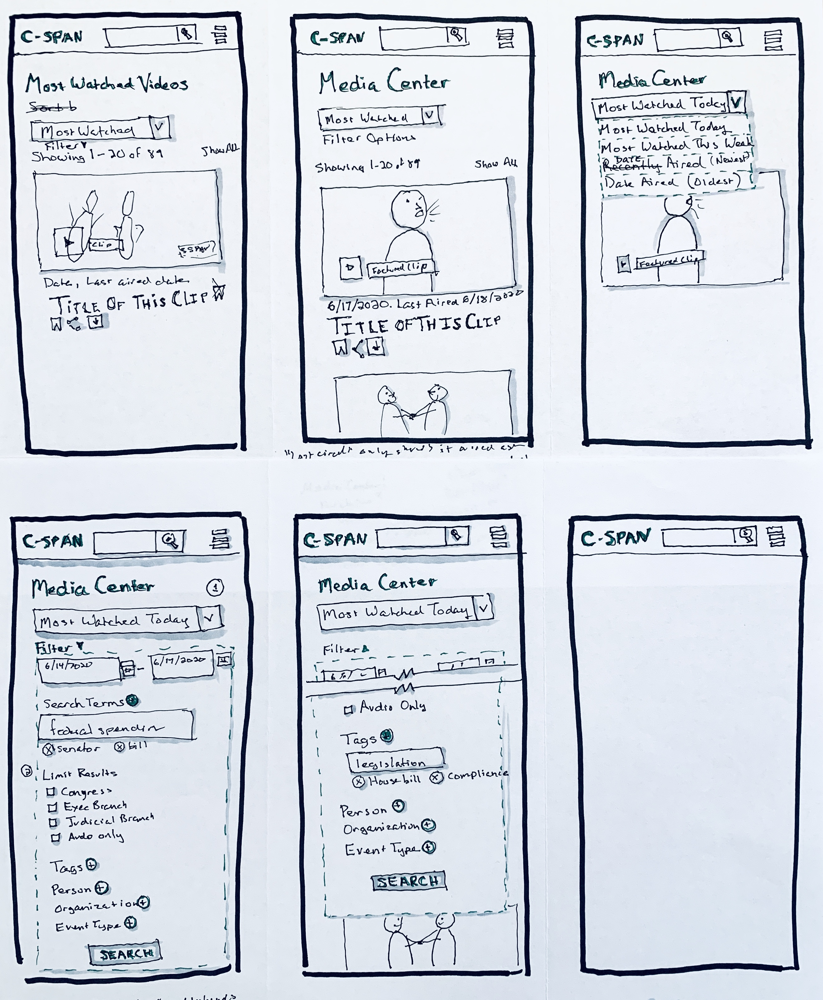

# C-SPAN Program Alert
## Description
This is an independent UX project that addresses a usability issue in the C-SPAN schedule that will allow users to set an alert for airing of live events that tend to start later than scheduled.

While earlier projects included wireframes, mock-ups, and prototypes, this project starts one step earlier to  showcase my skill-development in UX sketching, a valuable tool for teams engaged in the creative process.

## Problem Statement
If you're passionate enough about politics to watch press conferences, the last thing you want to do is join them late. C-SPAN streams the press conferences free of cost and free of commentary, making them a great source. However, their schedule doesn't reflect time-space reality, as press conferences rarely start on time. Repeatedly checking in to see if the event has started takes time, creates a distraction, and almost guarantees missing at least part of the conference.

A new feature and UX update will make finding the press conference start time easier, and a new text-based alert will allow the viewer to receive notification when the conference actually starts, including a link to the stream. This "set it and forget it" model will allow the viewer to get every last bit of information out of the press conference from the moment the podium is approached.

## First Wireframe

My first wireframe taught me three things:
1.  I CAN surrender to sketching with a pen
2.  Wire framing is a great way to find out you're heading in the wrong direction
3.  Asking for feedback is the fastest way to get to point 2.

Describing my wire frame to a friend revealed a logic issue with my search function. As I looked at it I started to realize that it wasn't relevant, because the whole approach had been wrong. I worked in the wrong direction. I worked "toward" the problem statement, instead of working on a granular level to address the specific needs the statement details. I'm working on a v.2, which will reflect that my shift in process.

